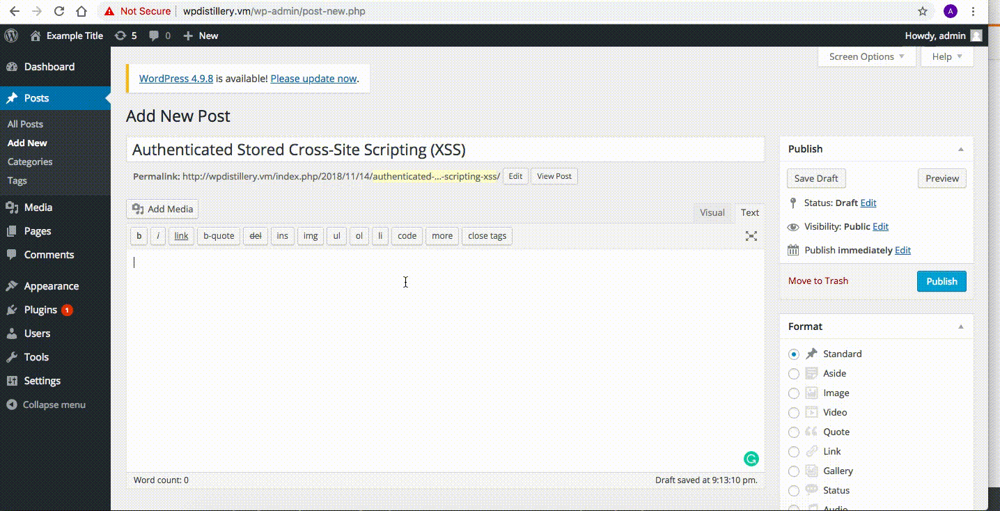

# Project 7 - WordPress Pentesting

Time spent: **5** hours spent in total

> Objective: Find, analyze, recreate, and document **three to five vulnerabilities** affecting an old version of WordPress

## Pentesting Report

1. (Required) WordPress 2.5-4.6 - Authenticated Stored Cross-Site Scripting via Image Filename
  - [X] Summary: An authenticated user can perform a XSS attack by editing an image's filename in the Media Library in WordPress and injecting JavaScript.
    - Vulnerability types: XSS
    - Tested in version: 4.2
    - Fixed in version: 4.2.10
  - [X] GIF Walkthrough: 
  - [X] Steps to recreate:
    - As an authenticated user who can add media to a WordPress site, go to Media > Library and click 'Add New'.
    - Select an image file and edit the filename to contain script (example given below).
    - Click 'View attachment page' and the script will execute.
  - [X] Affected source code:

2. (Required) WordPress <= 4.2 - Unauthenticated Stored Cross-Site Scripting (XSS)
  - [X] Summary: An unauthenticated user can make a XSS attack by adding JavaScript through the comment section of a post on a WordPress site. When the comment is viewed, the script is executed.
    - Vulnerability types: XSS
    - Tested in version: 4.2
    - Fixed in version: 4.2.10
  - [X] GIF Walkthrough: 
  - [X] Steps to recreate:
    - On a WordPress post, make a comment with HTML containing script (example given below). The comment must be extremely long (at least 64kB of text).
    - After posting, the JavaScript alert will appear when a user views the published comment.
  - [X] Affected source code:

3. (Required) WordPress <= 4.2.2 - Authenticated Stored Cross-Site Scripting (XSS)
  - [X] Summary: An authenticated user can make an attack by inserting HTML that contains malicious JavaScript into a WordPress page or post.
    - Vulnerability types: XSS
    - Tested in version: 4.2
    - Fixed in version: 4.2.1
  - [X] GIF Walkthrough: 
  - [X] Steps to recreate:
    - As an authenticated user, create a post with the HTML below.
    - After publishing the post, an alert will pop up when viewing the post on the site.
  - [X] Affected source code:

4. (Optional) WordPress  4.0-4.7.2 - Authenticated Stored Cross-Site Scripting (XSS) in YouTube URL Embeds
  - [X] Summary: An authenticated user can perform a XSS attack by adding JavaScript to a Youtube URL in an embed tag when editing the content of a post.
    - Vulnerability types: XSS
    - Tested in version: 4.2
    - Fixed in version: 4.2.13
  - [X] GIF Walkthrough: 
  - [X] Steps to recreate:
    - As an authenticated user, create a new post on WordPress.
    - In an embed tag, add HTML that contains an onload script (example given below).
    - After clicking 'Publish' and viewing the new post, the script will be executed.
  - [X] Affected source code:

5. (Optional) WordPress <= 4.3 - Authenticated Shortcode Tags Cross-Site Scripting (XSS)
  - [X] Summary: Attackers can inject script as authenticated users into tags ('shortcodes') that are enclosed by square brackets on a post because unclosed HTML elements are not properly being sanitized.
    - Vulnerability types: XSS
    - Tested in version: 4.2
    - Fixed in version: 4.2.5
  - [X] GIF Walkthrough: 
  - [X] Steps to recreate:
    - As an authenticated user, create a new post on WordPress.
    - Create a shortcode tag with an unclosed HTML anchor tag in its caption. Close the anchor tag outside of the shortcode tag, and then insert another HTML anchor tag that contains JavaScript (example given below).
    - After clicking 'Publish' and viewing the new post, the script will be executed when mousing over the tag.
  - [X] Affected source code:

## Assets

List any additional assets, such as scripts or files

## Resources

- [WordPress Source Browser](https://core.trac.wordpress.org/browser/)
- [WordPress Developer Reference](https://developer.wordpress.org/reference/)

GIFs created with [LiceCap](http://www.cockos.com/licecap/).

## License

    Copyright [2019] [Vineet Zunjarwad]

    Licensed under the Apache License, Version 2.0 (the "License");
    you may not use this file except in compliance with the License.
    You may obtain a copy of the License at

        http://www.apache.org/licenses/LICENSE-2.0

    Unless required by applicable law or agreed to in writing, software
    distributed under the License is distributed on an "AS IS" BASIS,
    WITHOUT WARRANTIES OR CONDITIONS OF ANY KIND, either express or implied.
    See the License for the specific language governing permissions and
    limitations under the License.
