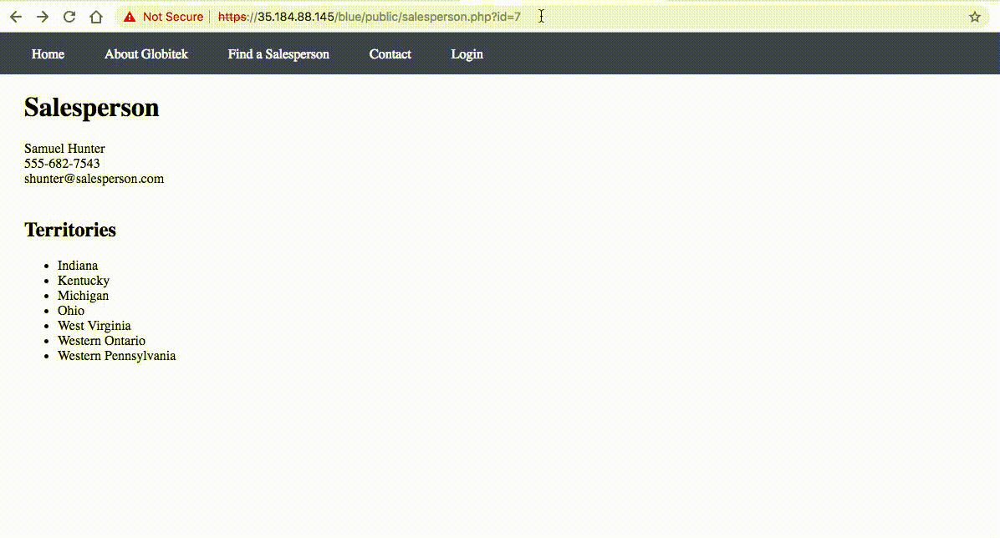
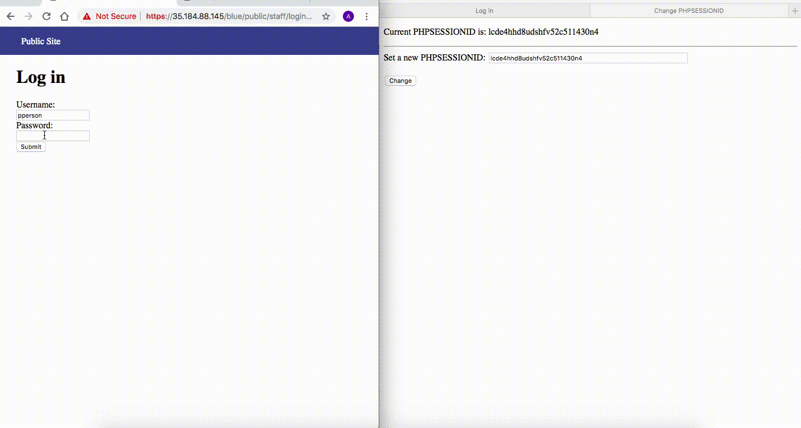
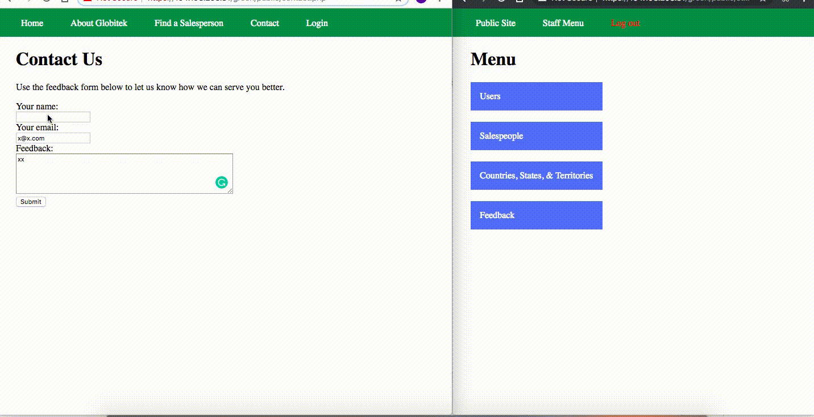
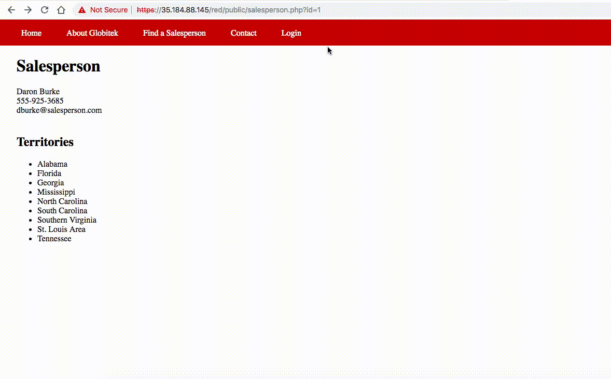
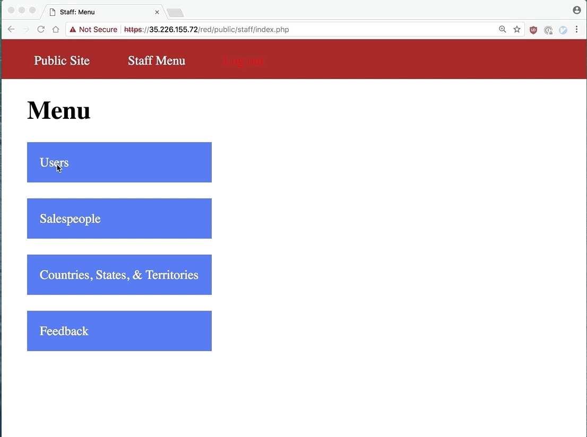

# Project 8 - Pentesting Live Targets

Time spent: **6** hours spent in total

> Objective: Identify vulnerabilities in three different versions of the Globitek website: blue, green, and red.

The six possible exploits are:
* Username Enumeration
* Insecure Direct Object Reference (IDOR)
* SQL Injection (SQLi)
* Cross-Site Scripting (XSS)
* Cross-Site Request Forgery (CSRF)
* Session Hijacking/Fixation

Each version of the site has been given two of the six vulnerabilities. (In other words, all six of the exploits should be assignable to one of the sites.)

## Blue

Vulnerability #1: SQL Injection
Under the salesperson information page, the user can perform an attack by adding a SQL injection to the end of the URL. As shown in the walkthrough, when adding ``` ' OR SLEEP(5)=0--' ``` to the end of the URL, the website shows a different staff member's profile, indicating that it responded to the SQL that was added. The mistake the developer made was not sanitizing the URL input.

GIF Walkthrough: 

Vulnerability #2: Session Hijacking
Since the session ID is not regenerated for this website, even when the user agent string changes, it is vulnerable to session hijacking. In the walkthrough, I showed how I can set the session ID in one browser (Safari) to the one generated from logging in to the website using another browser (Google Chrome). The attacker in the Safari browser is able to gain access to the staff area.

GIF Walkthrough: 

## Green

Vulnerability #1: User Enumeration
This vulnerability is on the Login page for the green website. The mistake the developer made was assigning a different class to failed login attempt message for valid usernames and invalid usernames. As shown in the walkthrough, attempting to login with the invalid username 'random' results in a 'Log in was unsuccessful' message that is bolded, under the class 'failed'. On the other hand, attempting to login with the valid username 'pperson' with the incorrect password results in the same message unbolded, under the class 'failure'. An attacker can use this vulnerability to enumerate through usernames to figure out which are valid.
GIF Walkthrough: 

Vulnerability #2: Cross-Site Scripting
On the contact page where users can leave feedback, the user has the ability to execute an XSS attack by injecting JavaScript into the name input of the form. In the walkthrough, I show how an alert injected by a public user can be executed when a staff member reviews the feedback. The browser on the left shows the attacker's perspective and the one on the right shows the target's perspective.
GIF Walkthrough: 

## Red

Vulnerability #1: Indirect Object Reference
Under staff information, each staff member's profile is identified by their ID, which is visible in the URL. In the red page, the user can simply change the ID to that of any person who is in the salesperson. While the other versions of the site redirect the user to the salesperson directory when changing the ID to that of a salesperson who is not listed on the public site, the red version still shows the non-public salesperson's profile.
GIF Walkthrough: 

Vulnerability #2: Cross-Site Request Forgery
Before the attack this is the user data stored in the site.
GIF Walkthrough: 
A logged on user loads a malicious page (csrf.html) carefully crafted by an attacker. This malicious page is hosted in a different server. After the attack, the name and last name of first user is modified.
GIF Walkthrough: 
